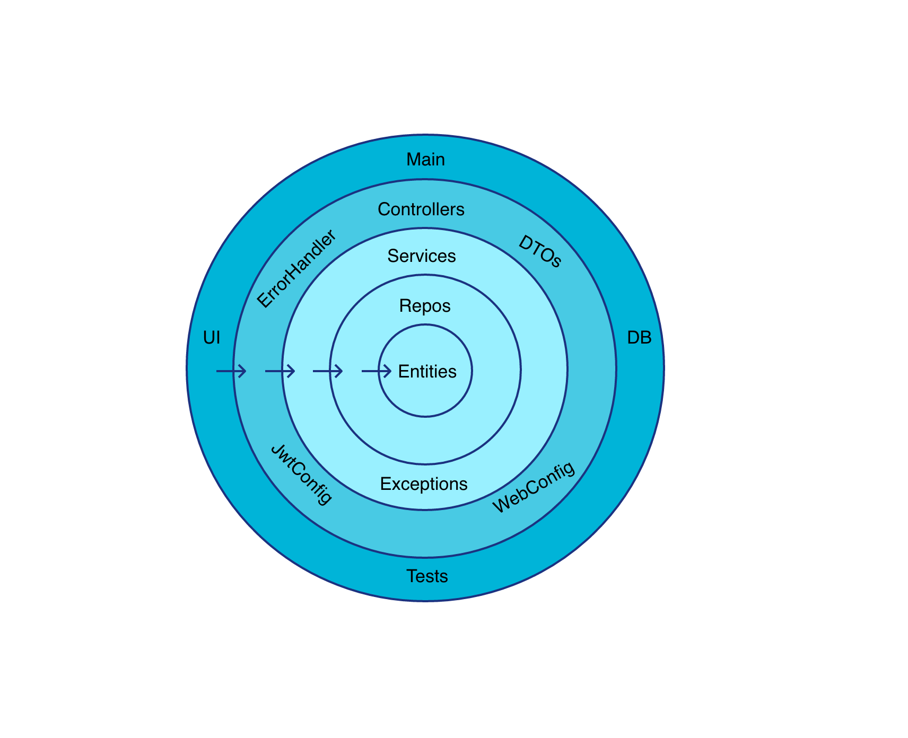
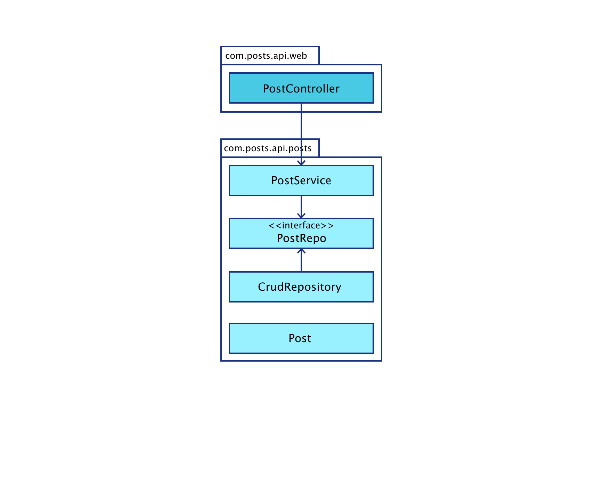

## API

### Technologies used

- Kotlin
- Spring Boot
  - Spring Web
  - Spring Data JPA
  - Spring Security
  - Spring Validation
- H2 Database
- Embedded Redis
- Java JWT
- Swagger

### Installation

- Go into project

```sh
cd /api
```

- Build

```sh
./gradlew build
```

- Run

```sh
./gradlew bootRun
```

### API documentation

- Via [Swagger](http://localhost:4000/swagger-ui.html#/)

### Architecture

- Multilayered architecture: each layer can only call their inner layers.
  

- Package by component: each domain has its own package component.
  
